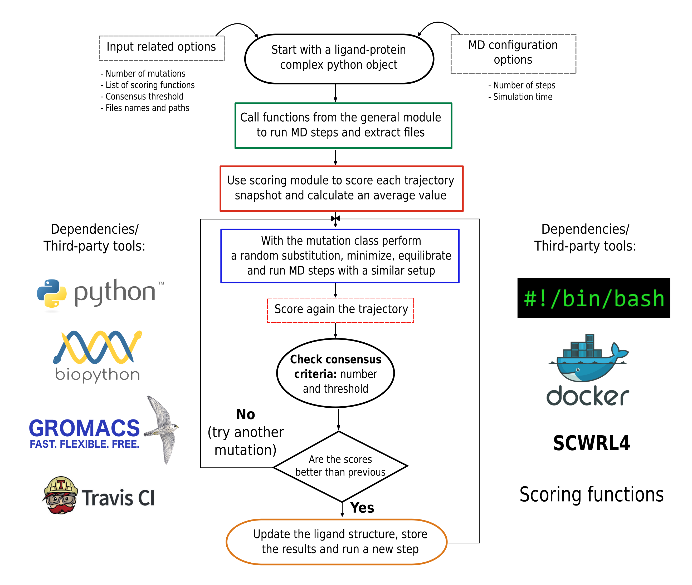

# PARCE

## Protocol for Amino acid Refinement through Computational Evolution

* From publication "PARCE: Protocol for Amino acid Refinement through Computational Evolution"
* Computer Physics Communications, 2020
* Authors: Rodrigo Ochoa, Miguel A. Soler, Alessandro Laio, Pilar Cossio

## Purpose

Here we present PARCE, an open source Protocol for Amino acid Refinement through Computational Evolution that implements an advanced and promising method for the design of peptides and proteins. The protocol performs a random mutation in the binder sequence, then samples the bound conformations using molecular dynamics simulations, and evaluates the protein-protein interactions from multiple scoring. Finally, it accepts or rejects the mutation by applying a consensus criterion based on binding scores. The procedure is iterated with the aim to explore efficiently novel sequences with potential better affinities toward their targets. We also provide a tutorial for running and reproducing the methodology.

## Required third-party tools:

- Gromacs 5.1.4 (tested version): http://manual.gromacs.org/documentation/5.1.4/download.html

**NOTE: Path to the executable can be provided in the configuration file**

**Please verify the permissions to run the program**. Gromacs 5.1.4 **(version tested in the protocol)** can be compiled and installed using the source code. 

- The scoring functions (BACH,Firedock,BMF-BLUUES,Pisa,ZRANK,IRAD) are provided in the **src** folder and configured to run the analysis.

- By default, an open source method to perform the single-point mutations, named FASPR (https://zhanglab.ccmb.med.umich.edu/FASPR/), is available in the code. The executable is included within the **src** folder. 

## Optional third-party tools:
- Scwrl4 (optional): http://dunbrack.fccc.edu/scwrl4/license/index.html

Scwrl4 can be installed freely after filling a form available in the website to obtain an academic license. Scwrl4 can be used to perform the single-point mutations in replacement of FASPR. 

**NOTE: The method can be changed in the configuration file explained in the sections below. The path to the executable can be provided in the configuration file.**

## Dependencies:
The BioPython and additional python modules (minimum python3.5) can be installed directly from the OS repositories. An example in Ubuntu 16.04 is:

```
sudo apt-get install pdb2pqr
sudo apt-get install python3-biopython
sudo apt-get install python3-pip
sudo apt-get install python3-tk
sudo apt-get install python3-yaml
python3 -m pip install GromacsWrapper==0.8 numpy==1.18 scipy==1.4 matplotlib==3.0
```

**NOTE: A `install_dependencies.sh` file is provided to automatize the installation of dependencies in the Linux (Ubuntu) operating system.**

## Input files required

To run the protocol, **first, a simulation with Gromacs of the starting complex is required. Typically, for the initial complex a sufficiently long simulation is necessary (100ns or so)**. After that, the following input files are required:

- A PDB file containing the starting system, including the protein, peptide and solvent. **Ideally renumber the chains to start from position 1 at each chain**
- The topology files of the chains.
- A GRO file of the PDB template structure with the same name of the PDB file.
- (Optional) Files with itp extensions that select the atoms restrained during the simulations.

## MDP files for Gromacs MD simulations

The protocol has included a set of mdp files (with fixed names) to run the MD simulation of each MC step after each mutation. These include the minimization steps, the NVT equilibration and the NPT production stages. The parameters have been optimized for the protocol efficiency and accuracy. **However, these parameters can be modified by the user, the source files can be found in the folder src/start/mdp. The default temperature of the system is 310K.**

## Graphical summary



## How to run the protocol script

**The protocol has been created and tested using minimum Python3.5**. The basic command line to run the script is:

`python3 run_protocol.py [-h] -c CONFIG_FILE`
                                       
where the arguments are:

```
arguments:
  -h, --help      show this help message and exits
  -c CONFIG_FILE  File containing all the necessary parameters to run the
                  protocol
 ```
 
The configuration file describes all the parameters required to run the protocol. A full detailed explanation is provided in the next section.

## Configuration file

A configuration file is required with the following parameters:

- **folder**: Name of the folder where all the output files of the protocol will be stored.
- **src_route**: Route of the PARCE folder where the *src* folder is located. This allows running the protocol in any location.
- **mode**: The design mode, which has three possible options: *start* (start the protocol from zero), *restart* (start from a particular iteration of a previous run) and *nothing* (just run without modifying existing files for debugging purposes).
- **peptide_reference**: The sequence of the peptide, or protein fragment that will be modified.
- **pdbID**: Name of the structure that is used as input, which contains the protein, the peptide/protein binder and the solvent molecules.
- **chain**: Chain id of the peptide/protein binder in the complex.
- **sim_time**: Time in nanoseconds that will be used to sample the complex after each mutation. *Recommended a minimum value of 5 ns*.
- **num_mutations**: Number of mutations that will be attempted.
- **try_mutations**: Number of mutations tried after having minimization or equilibration problems. *These issues can be found depending on the system and the previous sampling of the complex before starting the protocol*.
- **residues_mod**: These are the specific positions of the residues that will be modified. This depends on the peptide/protein length and the numbering in the PDB file. *It is recommended to renumber the input structure to associate the first position to residue number 1, for avoiding errors in posterior stages related with the renumbering of the coordinate files*.
- **md_route**: Path to the folder containing the input files, which are the files used during the previous MD sampling of the system.
- **md_original**: Name of the system PDB file located in the folder containing the previous MD sampling.
- **score_list**: List of the scoring functions that will be used to calculate the consensus. Currently the package has available: BACH, Pisa, ZRANK, IRAD, BMF-BLUUES and FireDock. *At least two should be selected.*
- **half_flag**: Flag that controls which part of the trajectory is used to obtain the average score. If *0*, the full trajectory is used, if *1*, only the last half.
- **threshold**: Threshold used for the consensus. If the number of scoring functions in agreement are equal or greater than the threshold, then the mutation is accepted.
- **mutation_method**: Protocol to perform the single-point mutations. There are 2 options: *faspr* (included within the code), and *scwrl4* (requires external installation).

*Optional arguments:*
-  **scwrl_path**: Provide the path to Scwrl4 in case it is not installed in a PATH folder. By default the system will use the system path to call the program.
-  **gmxrc_path**: Provide the path to GMXRC in case Gromacs was not included previously in the system path.

## Initial tests
A number of tests are provided to check the PARCE functionalities of the third-party tools. These are:

- Call to Gromacs functions to configure an example input file
- Attempt a mutation using the FASPR/Scwlr4 program
- Calculate all the scoring functions using the initial system provided

The test can be run using the following command: `python3 test.py`. A report with the results per test is generated in the main folder with the name `report_test.txt`.

**NOTE: Please change in the test.py script the paths to PARCE-1, the folder with the input files, and the programs Scwrl4 and Gromacs based on your local installation.**


## Tutorial example

The following is an example of the configuration file *(config_1ppg.txt)* for a protease-peptide complex provided in the code:
**NOTE: The <local_path>/PARCE-1 should be updated based on the location of the PARCE-1 folder**
```
folder: 1ppg_design
src_route: <local_path>/PARCE-1
mode: start
peptide_reference: AAPAAAPP
pdbID: 1ppg_AAPAAAPP
chain: B
sim_time: 5
num_mutations: 5
try_mutations: 10
half_flag: 1
residues_mod: 1,2,3,4,5,6,7,8
md_route: <local_path>/PARCE-1/design_input/peptide_protein
md_original: peptide_example
score_list: bach,pisa,zrank,irad,bmf-bluues,firedock
threshold: 3
mutation_method: faspr
gmxrc_path: /usr/local/gromacs/bin/GMXRC
```
If any of these parameters are missing, the protocol stops and prints a warning messsage to the user.

In addition, another configuration file called *(config_vhh.txt)* can be used to run a protein-protein example based on a nanobody protein interaction. The configuration file contains all the required information to run the analysis based on the starting data provided in the folder `design_output/protein_protein`.

In this example, the configuration file is prepared to run a minimal example of 5 mutation attempts using 5 ns per run. It implies a total of 25 ns of simulations, that could take around 10 hours on a server with 24 cores and GPU acceleration. In a local desktop the performance can be significantly lower. **So we recommend using a server with better infrastructure to take advantage of the Gromacs parallelizable code.**

## Output folder content
When a design run starts, an initial folder is created with the required input files, as well as the folders that will store the outputs step-by-step. The following is a list of the folders created, and the specific content stored:

- **binder**: Stores the peptide/protein structure after each mutation attempt.
- **target**: Stores the target structure after each mutation attempt.
- **iterations**: Stores the average scores calculated per each iteration.
- **mdp**: Stores the mdp files used for the molecular dynamics simulations.
- **complexP**: Stores the target-peptide/protein structure after each mutation attempt.
- **solvent**: Stores the solvent box after each mutation attempt.
- **system**: Stores the complete target-peptide/protein-solvent complex after each mutation attempt.
- **trajectory**: Stores the MD trajectory of the previous mutations.
- **score_trajectory**: Stores the average scores for each snapshot from the trajectories. *The file is split into four columns. The first column is the score of the complex. The second and third are the scores for the receptor and peptide alone. The fourth column is the total score after doing the difference between the complex and each component. For all of them it is possible to score the complex only. However the scoring function BACH can calculate the energies per component and subsequently apply the difference*.
- **log_npt**: Stores the log file from each npt run to verify possible errors.
- **log_nvt**: Stores the log file from each nvt run to verify possible errors.

The design protocol results are summarized in the output file called `mutation_report.txt`, which contains details per mutation step like the type of mutation, the average scores, the binder sequence and if the mutation was accepted or not. Regarding the type of mutation, it is defined with the nomenclature: [old amino acid][binder chain][position][new amino acid]. **An example of a mutation is AB2P, which means that an alanine located in the position number 2 of the chain B is replaced by a proline.**

In addition, the report includes failed attempts based on minimization or equilibration problems. The latest can happen depending on the MD result. To overcome these issues, the protocol automatically attempts a number of mutations using the immediately accepted structure. If the simulation keeps failing after a certain number of attempts (defined by the user in the inputfile with the keyword `try_mutations`), a new mutation will be attempted but using the complex that was accepted previous to the current one. If the problem persist during a number of mutations, the run will stop.

In addition, a file named `gromacs.log` stores the logging of all the Gromacs commands, and the file `gromacs_general_output.txt` stores the latest Gromacs command used, just to track the progress during the run. To guarantee that the additional tools and dependencies are functioning, a set of tests are provided.


## Analysis of the results and auxiliar scripts

With the final `mutation_report.txt`, it is possible to check and select the accepted sequences, and plot the scores to verify that they are minimizing after the mutation steps. The results are numbered per iteration step, and the folder's content facilitates locating the information. Examples of the analysis are provided in the original manuscript.

We also included a folder called `auxiliar_scripts` to perform some additional analysis. One script, `plot_result_scores.py`, generates plots showing the evolution of the scores, and the mutations accepted and rejected during the design. The input for that analysis is the `mutation_report.txt` file obtained after running a design cycle. To run the script first update it with the path where the `mutation_report.txt` file is located, and run the command `python3 plot_result_scores.py`. Two plots are created for each scoring function: one has only the accepted mutations whereas the other has also the rejected mutations (red points).

The second script, `score_trajectory.py`, calculates the scores for a given MD trajectory or single file in PDB format, printing the score per frame and the final average for each score. To run the script first update it with the path of the PARCE source folder and the path of the trajectory, together with the name of the file. **NOTE: The file should be in PDB format.**

The variables to modify are:

- src_route: Path of the PARCE src folder
- traj_path: Path where the PDB trajectory or single file is located
- pdb_name: Name of the PDB file containing the single complex or the MD trajectory frames

To run the command use the instruction `python3 score_trajectory.py`. The outputs are single files per scoring function with the calculated scores for all the frames included in the PDB file. With that output, the user can easily implement a consensus by vote based on the trajectories they require to compare. 

## Docker details

To run the docker image (https://hub.docker.com/r/rochoa85/parce-1), first you require to install Docker in the operating system of interest. A guide of the distributions for Docker Desktop (Windows and Mac) and Docker server (Linux) can be found here: https://docs.docker.com/engine/install/

After verifying the correct installation, and checking if `sudo` is required or not, the image can be downloaded as follows:

```docker pull rochoa85/parce-1:latest```

To create the container and start playing with the protocol use the following command:

```docker run -it rochoa85/parce-1 /bin/bash```

After that, you can find the code in the folder: `/home/PARCE-1` and start after following the instructions provided in the README. **In this scenario, the only external software required to be installed is Scwrl4, but if FASPR is selected no additional installations is required.**

The previous `docker run` command is used **only the first time**. After that, please exit by entering the command `exit`. Then you can check the container created with the command `sudo docker ps -a`. The **container-id** is in the first column, which will be used to access later the docker container, **so the changes made to the container will be stored**. To achieve that, first activate the **container-id** with:

```docker start container-id```

and then open the bash environment with the following command

```docker exec -it container-id /bin/bash```

The latest command allows entering again to the container bash environment. The `start` and `exec` commands will be used to keep accessing the container (with previous installed programs) and maintain the modifications and output files generated by the protocol.

**Note: To have instructions about how to use docker in different OS, follow these tutorials:**

- Windows: https://docs.docker.com/docker-for-windows/
- Mac: https://docs.docker.com/docker-for-mac/
- Linux distributions: https://docs.docker.com/engine/install/ubuntu/

## External references

If you implement this protocol and publish the results, these references to external programs should be included:

- Gromacs: Hess et al., J. Chem. Theory Comput., 4, 435–447, 2008
- Scwrl4: Krivov et al., Proteins: Struct. Funct. Bioinf., 77 (4), 778–795, 2009.
- FASPR: Huang, Pearce and Zhang. Bioinformatics, 36, 3758-3765, 2020.
- Bach:  Cossio et. al., Sci. Rep., 2, 1–8. 2012.  Sarti et al., Comput. Phys. Commun., 184 (12), 2860–2865. 2013. Sarti et. al, Proteins: Struct. Funct. Bioinf., 83 (4), 621–630, 2015.
- Pisa: Krissinel and  Henrick, J. Mol. Biol., 372 (3), 774–797, 2007
- Firedock: Andrusier et al., Proteins: Struct. Funct. Bioinf., 69 (1), 139–159, 2007. 
- Irad: Vreven et al., Protein Sci., 20 (9), 1576–1586, 2011. 
- Zrank: Pierce and Weng, Proteins: Struct. Funct. Bioinf., 67 (4), 1078–1086 2007.
- BMF-Bluues: The programs bluues (Fogolari et al., BMC Bioinformatics, 13 (S4), S18, 2012)  and  score_bmf (Berrera et al.,  BMC Bioinformatics, 4, 8, 2003) were kindly provided by Prof. F. Fogolari, University of Udine.

## Support

In case the protocol is useful for other research projects and require some advice, please contact us to the email: rodrigo.ochoa@udea.edu.co
